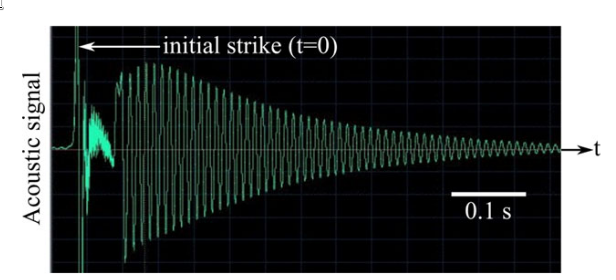
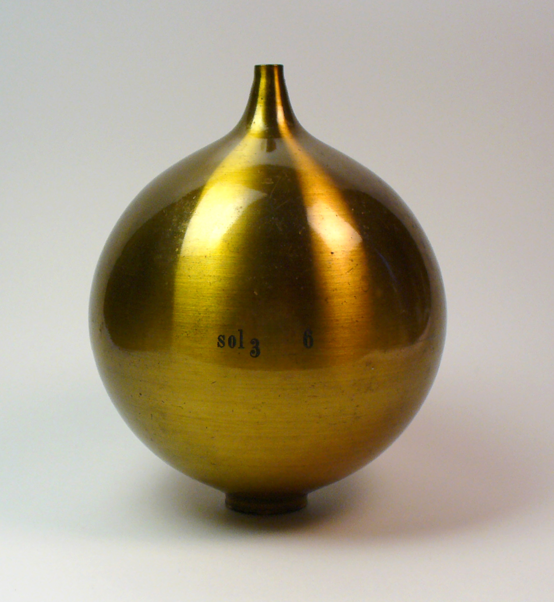
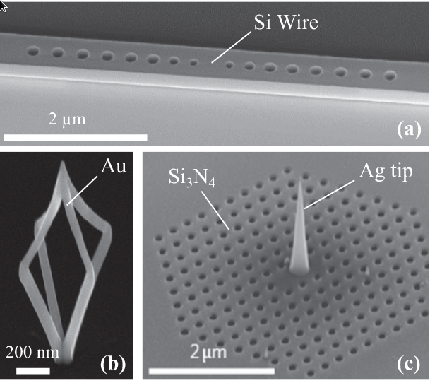

---
title:
- Struggles in Science (Practice Talk)
author:
- Mae Andersen
theme:
- Copenhagen
date:
- September 22 2023
bibliography:
- refs.bib
---

# What is an Optical Resonator?

An optical resonator is characterized by its **resonant modes**. 
------

# Jargon: Resonant Modes

- `resonant`: Something that continues to ring or "sing"
- `mode`: Any distict pattern or vibration in a physical system
------
# Revisit: What is an Optical Resonator?

An optical resonator is an object that when interacting with light, will continue
ring or "sing" with light. You will notice that this "singing" only occures for distinct
patterns or vibrations of light.
------
# Idea \#1 of Optical Resonators
> Has `resonant modes` which get excited due to incoming light.

# Illustration of an accoustic resonant mode

*The accoustic resonator is knocked by the palm of a hand ($t=0$).*

 *refs:[@Lalanne2018]*

------

# Illustration of an accoustic resonant mode

{width=50%}
{width=30%}
https://en.wikipedia.org/wiki/Helmholtz_resonance#/media/File:Helmholtz_resonator.jpg

*The accoustic resonator is knocked by the palm of a hand ($t=0$).*

- initially, the accoustic signal is very complex
- for $t>0.1, the accoustic signal:
	- oscillates ate the resonant frequency 
	- gradually decays in time

 *refs:[@Lalanne2018]*

------
# Question: Resonant modes have distinct patterns or frequecies, but do they decay at the same rate? Are there any examples of resonators that migt "out sing" another? Discuss w/ your neighbor
--

# Idea \#2 of Optical Resonators
> A `resonant mode`'s energy decays after it gets excited (some decay really fast while others take a while).

---

# Idea \#3 of Optical Resonators
> Looking at the resonator signal after "long enough" is a way to look at the resonant mode's signal!
{width=20%}

---
# Question: Can Resonators (Optical or Accoustic) have multiple resonant modes? Discuss w/ your neighbor
---
# Resonators Come in All Shapes, Sizes, and Materials

- Optical resonators are actually very diverse!
	- `(a)` just patterns of holes
	- `(b)` it looks like a cage?
	- `(c)` it is a tip in the middle of holes
{width=50%}

 *refs:[@Lalanne2018]*
-----
#  Make good experiences in stem!!!
----
# My entire social life changed, and that was hard

When I came out, my social identity changed non-adiabatically. I had to build a new social life as a new person. It was one of the hardest things I've ever done.
----
# I accumulated a lot of stress from wearing dresses and makeup out in public

At age 24, I felt really really **really* awkward trying to be myself