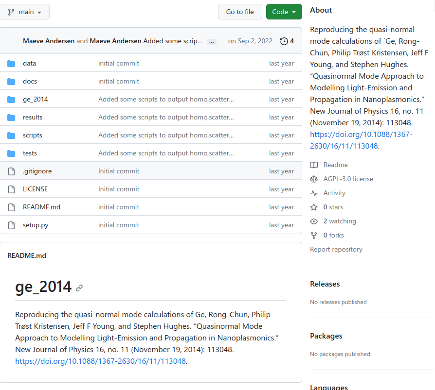
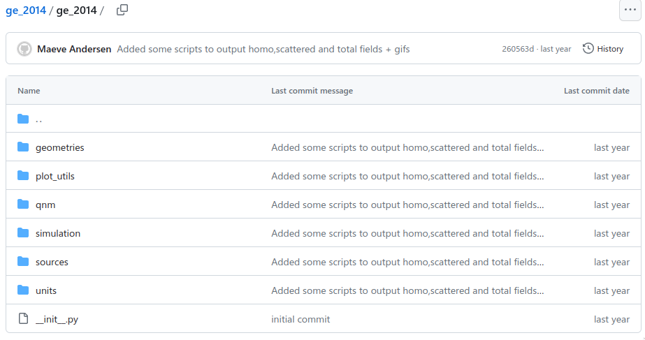
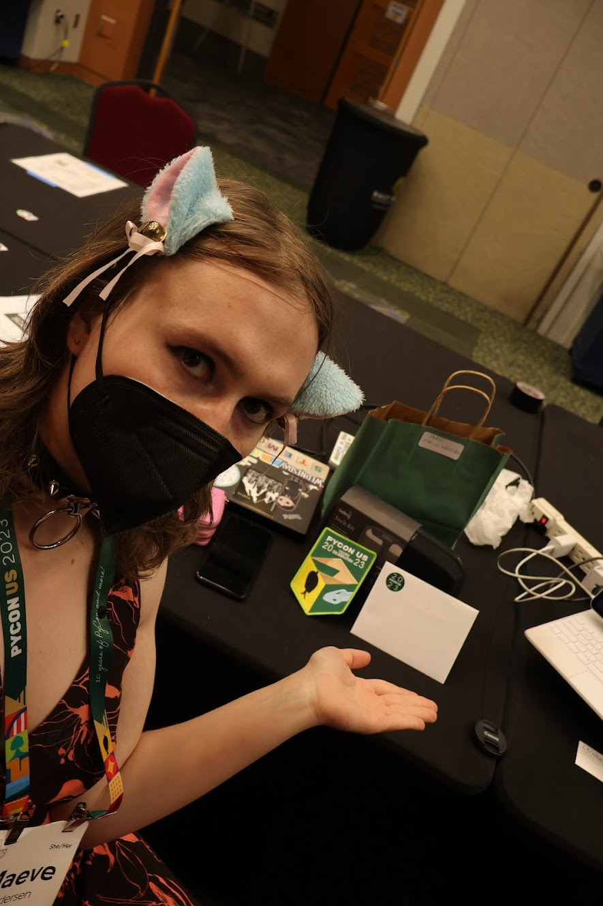

## About Me

- 27 years old
- trans femminine 
- genderf\*ck
- 5th year grad student
- currently rebuilding my life (2 yrs post transition)
- has a cat
- has 3 girl friends

## Trigger warning

This talk also tells my "story" which is not pretty. It may be 
triggering for some of you in the audience. The door is open,
please let yourself out at anytime. 

> trigger warning for drug abuse, discussion of harassment, suicide/suicidal ideation, and generally uncomfortable topics

## A bit more about me

- I am neurodivergent
- I struggle from prescription drug abuse
- I am girlfriends with someone who is homeless
- I have people in my circle of connections who have literally nothing and could die tomorrow
- Since transitioning, I've experienced verbal harrasment in public about once every few months
- My main community consists of trans, non-binary, and intersex folk

## Vibes of initially coming out as a grad student

> I just remember feeling like everyday was the most embarrassing day of my life for months on end. Not just that, but while walking to the university or even just gardening (on campus grounds), I was given the middle finger, had someone yell about cutting dicks off and then running away, someone yelled when they saw me "it's a man!", and someone also agressively told me "fuck you" and proceeded to give me the middle finger at a bus stop. I cried. A lot. For most of those. Except the last one, where I smiled at the woman and gave her the middle finger in return, but I'm not sure that was a "good" outcome even.
 

## Day in my life

## right after coming out

- sleep for 24 hours
- wakeup at 4 pm
- take my anti depressants & Adderall
- go into office at 6pm
- take a second dose of Adderall
- get lost in weird but fun math
- make coffee, walk around
- feel pretty + smart
- stay up all night doing homework

## right after coming out cont. 

- at 4am say hello to custodial staff
- folks in the office come in at around 9am or 10am
- take more Adderall
- go to class all loopy during the afternoon
- go home after class and try to do more homework
- feeling out of control, so consume THC
- lay in bed unable to move
- regardless, still obsessed with quantum electrodynamics
- wonder if there are nice packages to formalize my code
- pass out

## over a year after coming out

At this point I was spending a few weeks in Utah to live with my
ex-girlfriend (at the time girlfriend) and her girlfriend (my metamore). 
My ex-gf was holding my meds for me. I also met one of my current girlfriends
there who crashed on our couch as she was without a home or stable place to stay. 

## over a year after coming out

- wakeup 
- ask ex-gf for one of my Vyvance (ADHD med)
- do housewife stuff (clean kitchen, cook breakfast)
- talk to my ex-gf about philosophy
- grade
- play games
- grade

## over a year after coming out cont.

- snuggle with stuffies
- my gf comes over
- I ask ex-gf for another Vyvance
- I snuggle with my gf in the littles room
- I grade more
- everyone plays magic
- bedtime

## Research experience after coming out

> Research was irregular and often not productive. I eventually just had to stop the project and leave my research group.

## Life today

I am two years on hormone replacement therapy and am starting to feel comfortablin my own skin. I am starting to open up to others again. That being said, I am a minority and I struggle with that along facial dysphoria. 

## jargon

- `dysphoria` for me is a mismatch between how my body looks and how I perceive myself
- `facial dysphoria` for me means that I want my brow bone reshaped to be more flat among other things

## Introducing Optical Resonators 

## What is an Optical Resonator?

An optical resonator is characterized by its **resonant modes**. 

## Jargon: Resonant Modes

- `resonant`: Something that continues to ring or "sing"
- `mode`: Any distict pattern or vibration in a physical system

## Question: Do you know any examples of resonators? Discuss with your neighbor

*Hint: resonators don't have to be optical*

## Examples of resonators

- Guitars! {width=20%}
- Quartz! {width=20%}

## Revisit: What is an Optical Resonator?

An optical resonator is an object that when interacting with light, will continue
ring or "sing" with light. You will notice that this "singing" only occures for distinct
patterns or vibrations of light.

## Idea \#1 of Optical Resonators
> Has `resonant modes` which get excited due to incoming light.

## Illustration of an accoustic resonant mode

*The accoustic resonator is knocked by the palm of a hand ($t=0$).*

 *refs:[@Lalanne2018]*

## Illustration of an accoustic resonant mode

{width=50%}
{width=30%}
https://en.wikipedia.org/wiki/Helmholtz\_resonance#/media/File:Helmholtz\_resonator.jpg

*The accoustic resonator is knocked by the palm of a hand ($t=0$).*

- initially, the accoustic signal is very complex
- for $t>0.1$, the accoustic signal:
	- oscillates at the resonant frequency 
	- gradually decays in time

 *refs:[@Lalanne2018]*

## Question: What controlls the rate of decay for cavities? Discuss with your neighbor

## Idea \#2 of Optical Resonators

> A `resonant mode`'s energy decays after it gets excited (some decay really fast while others take a while).

## Idea \#3 of Optical Resonators

> Looking at the resonator signal after "long enough" is a way to look at the resonant mode's frequency!

{width=40%}

## Question: Can Resonators (Optical or Accoustic) have multiple resonant modes? Discuss w/ your neighbor

## Resonators Come in All Shapes, Sizes, and Materials

- Optical resonators are actually very diverse!
	- `(a)` just patterns of holes
	- `(b)` it looks like a cage?
	- `(c)` it is a tip in the middle of holes
{width=50%}

 *refs:[@Lalanne2018]*

## How I did research in computing optical modes

## Step one: try to reproduce some papers

I worked on reproducing the quasi-normal mode calculations of Ge, Rong-Chun, Philip Trøst Kristensen, Jeff F Young, and Stephen Hughes. “Quasinormal Mode Approach to Modelling Light-Emission and Propagation in Nanoplasmonics.” New Journal of Physics 16, no. 11 (November 19, 2014): 113048. https://doi.org/10.1088/1367-2630/16/11/113048.

## Make a github repo!

{width=70%}

## Jargon, what's github?

Github is a place to store git repos

## Jargon, what's a git repo?

A git repo is a "version control system", meaning that it keeps track of your files
and allows you to keep track of file history as well! A git repo allows you to "go back in time"
to previous versions of your project!

## Project Layout

I reccomend Patrick Mineault's **The Good Research Code Handbook**: `https://goodresearch.dev/`

## My Layout 

Scientific code projects have a lot more than just code. Here is how I organized things.

- `results` I stuck my results here. things to show an advisor or put in a talk (meta)
- `ge_2014` This folder has the code that should reflect key ideas of the paper
- `scripts` Auxillary code and commands to generate plots, data, etc..
- `docs` Put descriptions of your code and project in here

## ge\_2014

## EPILEPSY WARNING

The following slides contain flashing colors! 

## Results of light hitting a metal rod

## Results of the same sim, but no metal rod

## Results of the light hitting metal rod MINUS the no metal rod sim

## Closing Remarks 

##  Make good experiences in stem!!!

{width=%20}

## My entire social life changed, and that was hard

When I came out, my social identity changed non-adiabatically. I had to build a new social life as a new person. It was one of the hardest things I've ever done.

## I accumulated a lot of stress from wearing dresses and makeup out in public

At age 24, I felt really really **really* awkward trying to be myself

## Refs

- [quartz oscillator image](https://en.wikipedia.org/wiki/Crystal_oscillator#/media/File:Quartz_crystal_internal.jpg) `https://en.wikipedia.org/wiki/Crystal_oscillator#/media/File:Quartz_crystal_internal.jpg`
- [guitar image](https://en.wikipedia.org/wiki/Guitar#/media/File:GuitareClassique5.png) `https://en.wikipedia.org/wiki/Guitar#/media/File:GuitareClassique5.png`
